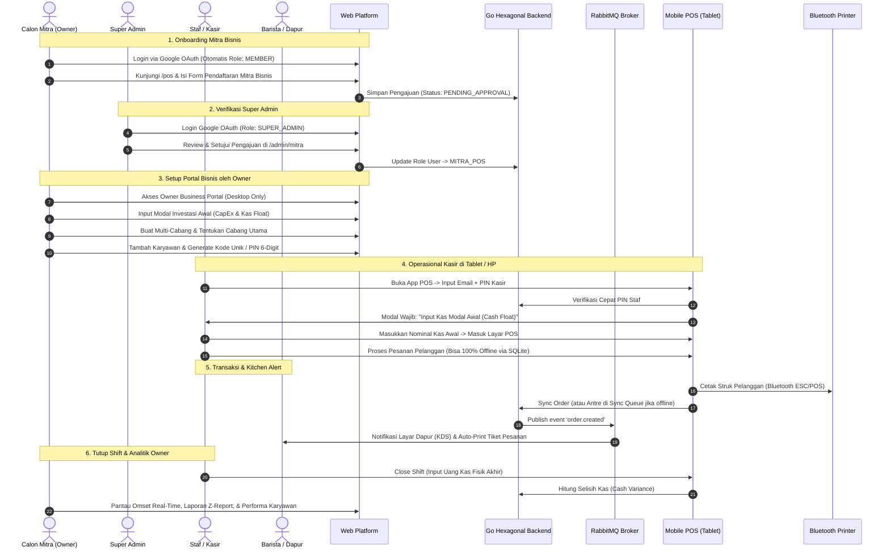

# LampungDevTech Platform

<div align="center">
  
  <h3>Platform Komunitas Developer & Ekosistem Solusi Bisnis Digital Lampung</h3>
  <p>Wadah kolaborasi talenta teknologi serta pemberdayaan pebisnis lokal melalui solusi digital berstandar enterprise.</p>

  <p>
    <a href="https://github.com/lampungdevtech/lampungdevtech-platform/actions"></a>
    <a href="https://nodejs.org/"></a>
    <a href="https://pnpm.io/"></a>
    <a href="https://nx.dev/"></a>
    <a href="LICENSE"></a>
  </p>
</div>

---

## 🎯 Motivasi Project & Masalah yang Diselesaikan (Problem Statement)

LampungDevTech lahir bukan hanya sebagai direktori website biasa, melainkan sebagai ekosistem terpadu untuk memecahkan dua masalah nyata di Provinsi Lampung:

### 1. Kesenjangan Ekosistem Talenta & Komunitas Teknologi
- **Problem**: Informasi kegiatan teknologi (meetup, workshop, sertifikasi) sering tersebar dan tidak terarsip dengan baik, menyulitkan developer dan mahasiswa di Lampung untuk berjejaring dan meningkatkan keterampilan digital.
- **Solusi**: Fitur **Event Management terintegrasi berbasis MongoDB** dengan manajemen kapasitas otomatis, antrean *waiting list* atomik, dan sistem absensi berbasis QR Code.

### 2. Tantangan Keberlanjutan Pebisnis Kafe & F&B Pemula (Early-Stage Entrepreneurs)
- **Problem**:
  - **Kegagalan Manajemen Modal Awal (CapEx vs OpEx)**: Sebagian besar pengusaha kafe pemula tidak melacak pengeluaran investasi awal (sewa ruko, mesin espresso, renovasi bar) sehingga tidak mengetahui titik impas (Break-Even Point / BEP) dan laba bersih yang sesungguhnya.
  - **Kebocoran Bahan Baku & Resep HPP**: Ketiadaan pencatatan resep bahan baku (*Bill of Materials*) mengakibatkan stok susu, sirup, dan biji kopi bocor tanpa kontrol margin keuntungan.
  - **Kerentanan Jaringan Internet (Offline Vulnerability)**: Sistem kasir berbasis cloud murni sering macet ketika koneksi internet terputus saat jam sibuk (*rush hours*), menyebabkan antrean panjang dan kerugian penjualan.
  - **Blind Spot Ekspansi Multi-Cabang**: Ketika membuka cabang kedua dan ketiga, pemilik bisnis kesulitan mengawasi performa karyawan, kas harian, dan ketersediaan menu secara terpusat.
- **Solusi**: LampungDevTech menghadirkan **Ekosistem Cafe POS Multi-Cabang**:
  - Portal Pemilik Bisnis berbasis web untuk pelacakan modal awal (CapEx), kalkulator BEP, manajemen multi-cabang, resep HPP, dan analitik kinerja staf.
  - Aplikasi kasir tablet/HP berbasis **React Native Expo Offline-First** dengan SQLite dan generator ULID yang tetap beroperasi lancar tanpa internet, lengkap dengan integrasi printer thermal Bluetooth (ESC/POS) dan notifikasi dapur otomatis (*Kitchen Display System*).

---

## 🔄 Alur Bisnis Menyeluruh (Business & User Workflow)



---

## 🌟 Fitur Utama (Key Features)

### 1. Platform Komunitas & Event Management
- **Dukungan Bilingual (i18n)**: Rute ter-lokalisasi `/id` (Default) dan `/en`, persistensi bahasa via cookie, dan komponen Language Switcher interaktif.
- **Event Management (MongoDB)**: Manajemen event, pencarian teks, filter kategori & status, kuota atomik dengan `$inc`, antrean otomatis *waiting list*, dan QR Code check-in absensi.

### 2. Solusi Cafe POS untuk Pebisnis (Mitra POS)
- **Kalkulator BEP & ROI Interaktif**: Simulasi waktu balik modal berdasarkan biaya sewa, mesin espresso, HPP, dan target penjualan harian.
- **Multi-Cabang & Cabang Utama**: Manajemen banyak cabang, pengaturan meja, dan penyesuaian harga khusus cabang.
- **Resep Bahan Baku (BOM) & HPP Otomatis**: Integrasi menu dengan bahan baku untuk mencegah kebocoran stok dan menghitung margin kotor per produk.
- **Manajemen Karyawan**: Pendaftaran kasir/barista dan generator kode unik (PIN) 6-digit untuk login cepat tanpa Google OAuth di perangkat kasir bersama.
- **Analitik Kinerja Karyawan**: Pemantauan jumlah transaksi yang diproses, kontribusi omset per kasir, kecepatan layanan, dan riwayat selisih kas (*cash discrepancy*) saat tutup shift.

### 3. Mobile POS Kasir (React Native Expo)
- **Offline-First Resilience**: Beroperasi lancar tanpa koneksi internet menggunakan **SQLite (`expo-sqlite`)** dan generator **ULID**.
- **Mesin Sinkronisasi (Sync Queue)**: Mengunggah transaksi otomatis saat internet tersambung kembali dengan proteksi *Idempotency-Key*.
- **Integrasi Bluetooth Printer (ESC/POS)**: Pencetakan struk kasir dan tiket dapur otomatis.

---

## 🏗️ Arsitektur Sistem & Technology Stack

```
                               ┌─────────────────────────────────────────┐
                               │       Client & Application Layer        │
                               └─────────────────────────────────────────┘
                                  │                     │               │
                     ┌────────────┴──────────┐   ┌──────┴──────┐ ┌──────┴──────────┐
                     │ Next.js 15 Web & POS  │   │ Mobile POS  │ │ Kitchen Display │
                     │   Owner Dashboard     │   │ (Expo/SQLite│ │ (KDS Tablet/Web)│
                     └───────────────────────┘   └─────────────┘ └─────────────────┘
                                  │                     │               │
                               ┌─────────────────────────────────────────┐
                               │  API Gateway (Traefik / Nginx Reverse)  │
                               └─────────────────────────────────────────┘
                                  │
                               ┌─────────────────────────────────────────┐
                               │   GoFiber Hexagonal Microservices       │
                               │   (REST fasthttp & gRPC Protobuf)       │
                               ├─────────────┬─────────────┬─────────────┤
                               │ auth-svc    │ order-svc   │ catalog-svc │
                               ├─────────────┼─────────────┼─────────────┤
                               │ inv-svc     │ finance-svc │ notif-svc   │
                               └─────────────┴─────────────┴─────────────┘
                                  │           │             │           │
            ┌─────────────────────┴───┐ ┌─────┴──────────┐ ┌┴───────────┴─────────┐
            │ PostgreSQL (Transaksional│ │ MongoDB (Event │ │ Redis (Locks & Cache)│
            │  Ledger, Cabang, Shift) │ │  & Menu Catalog│ │ RabbitMQ (Outbox Bus) │
            └─────────────────────────┘ └────────────────┘ └───────────────────────┘
```

| Layer | Teknologi | Peran / Deskripsi |
| :--- | :--- | :--- |
| **Frontend Web** | Next.js 15 (App Router), React 19, TypeScript | Platform publik, portal pendaftaran mitra, dan dashboard owner. |
| **Desain & UI** | Tailwind CSS, Radix UI Primitives, Lucide Icons | Desain responsif, dark/light mode, dan paket internal `@lampung-devtech/shared-ui`. |
| **Mobile Kasir** | React Native Expo, SQLite (`expo-sqlite`), ULID | Aplikasi kasir tablet/HP offline-first dengan Bluetooth printer. |
| **Backend Services** | Go 1.23+, GoFiber (`fasthttp`), gRPC Protobuf | Microservices berkecepatan tinggi dengan Hexagonal Architecture. |
| **Database** | PostgreSQL 16 & MongoDB 7.0 | PostgreSQL untuk ledger/finansial ACID; MongoDB untuk katalog menu & event. |
| **Cache & Lock** | Redis 7 | Distributed locking meja/order dan caching data performa tinggi. |
| **Messaging** | RabbitMQ 3.13 (Topic Exchange) | Event bus asinkron (*order.created*, *stock.low_alert*, *shift.closed*). |
| **Infrastruktur** | Docker Compose & Kubernetes (K3s / Managed K8s) | Docker Compose untuk lokal dev; K8s dengan HPA autoscaler untuk jam sibuk kafe. |

---

## 📁 Struktur Repositori (Nx Monorepo)

```
lampungdevtech-platform/
├── apps/
│   ├── web/                                # Next.js 15 Web Platform & Owner Portal
│   │   ├── app/
│   │   │   ├── [locale]/                   # Rute bilingual (/id, /en)
│   │   │   │   ├── events/                 # Halaman daftar & detail event
│   │   │   │   ├── pos/                    # Landing page POS & form pendaftaran mitra
│   │   │   │   │   ├── register/           # Form pendaftaran mitra POS
│   │   │   │   │   └── dashboard/          # Owner Business Portal (Multi-cabang, CapEx, Karyawan)
│   │   │   │   └── admin/mitra/            # Super Admin approval portal
│   │   │   └── api/                        # API route handlers
│   │   ├── components/                     # Komponen UI & Language Switcher
│   │   ├── i18n/                           # Konfigurasi routing next-intl
│   │   └── locales/                        # Kamus terjemahan id & en
│   └── web-e2e/                            # End-to-End testing (Cypress)
├── packages/
│   └── shared-ui/                          # Paket komponen UI terpusat (@lampung-devtech/shared-ui)
├── docs/                                   # Dokumentasi spesifikasi modular per fitur
│   ├── 01-event-management-mongodb.md      # Spesifikasi Event Management (MongoDB)
│   ├── 02-pos-business-web-platform.md     # Spesifikasi Owner Portal & Landing POS
│   ├── 03-pos-backend-hexagonal-microservices.md # Spesifikasi GoFiber Hexagonal Backend
│   ├── 04-pos-mobile-offline-first.md      # Spesifikasi Mobile POS Expo Offline-First
│   └── 05-pos-devops-infrastructure-cicd.md# Spesifikasi Kubernetes (K8s) & Docker
├── pnpm-workspace.yaml                     # Konfigurasi pnpm workspace
├── nx.json                                 # Konfigurasi task runner Nx
└── package.json                            # Root dependensi monorepo
```

---

## 🚀 Memulai Pengembangan Lokal (Getting Started)

### Prasyarat Sistem (Prerequisites)
Pastikan perangkat pengembangan Anda telah terinstal:
- **Node.js**: Versi **>= 24.x LTS** (wajib seragam dengan CI runner).
- **pnpm**: Versi **>= 11.x** (package manager monorepo).
- **Docker & Docker Compose**: (Opsional, untuk menjalankan PostgreSQL, MongoDB, Redis, dan RabbitMQ lokal).
- **Git**: Versi terbaru.

### 1. Kloning Repositori
```bash
git clone https://github.com/lampungdevtech/lampungdevtech-platform.git
cd lampungdevtech-platform
```

### 2. Instalasi Dependensi Monorepo
Gunakan `pnpm` untuk menginstal seluruh dependensi workspace:
```bash
pnpm install
```

### 3. Konfigurasi Environment Variables
Salin template konfigurasi lingkungan dari berkas `.env.example` ke `.env` dan `apps/web/.env.local`:
```bash
cp .env.example .env
cp .env.example apps/web/.env.local
```
> [!NOTE]
> Berkas [`.env.example`](.env.example) telah didokumentasikan lengkap dalam bahasa Inggris dan mencakup konfigurasi untuk Web Platform, MongoDB, PostgreSQL, Redis, RabbitMQ, JWT Secret, serta Google OAuth.

### 4. Menjalankan Server Pengembangan Web Platform (Nx Dev)
Jalankan aplikasi web Next.js 15 menggunakan perintah Nx:
```bash
# Menjalankan aplikasi web
pnpm exec nx dev web

# Atau menggunakan shortcut script
pnpm start:web
```
Buka browser di endpoint berikut:
- **Beranda & Komunitas**: `http://localhost:3000/` (Otomatis dialihkan ke `/id`)
- **Event Management**: `http://localhost:3000/id/events`
- **Scanner Check-in Tiket Hari-H**: `http://localhost:3000/id/events/check-in`
- **Solusi Bisnis & Edukasi POS**: `http://localhost:3000/id/pos`
- **Pendaftaran Mitra POS Kafe**: `http://localhost:3000/id/pos/register`
- **Portal Super Admin Approval Mitra**: `http://localhost:3000/id/admin/mitra`
- **Owner Business Portal (BEP & CapEx)**: `http://localhost:3000/id/pos/dashboard`
- **Terminal Kasir POS (Web Tablet Emulator)**: `http://localhost:3000/id/pos/terminal`
- **Kitchen Display System (KDS Dapur & Bar)**: `http://localhost:3000/id/pos/kds`

### 5. Menjalankan Infrastruktur Database Lokal (Docker Compose)
Untuk menjalankan PostgreSQL 16, MongoDB 7.0, Redis 7, dan RabbitMQ 3.13 di komputer lokal:
```bash
docker compose up -d
```
Dashboard & koneksi pendukung:
- **RabbitMQ Management**: `http://localhost:15672` (User: `guest`, Pass: `guest`)
- **MongoDB Native**: `localhost:27017`
- **PostgreSQL**: `localhost:5432` (Database: `pos_db`)
- **Redis**: `localhost:6379`

### 6. Menjalankan Backend Microservice GoFiber (Hexagonal)
Pastikan dependensi Docker atau Go telah terinstal, lalu jalankan service:
```bash
cd backend
go run cmd/server/main.go
# Atau menggunakan Docker:
docker build -t pos-backend .
docker run -p 8080:8080 pos-backend
```
Service akan aktif di port `8080` (`http://localhost:8080/healthz`).

### 7. Menjalankan Mobile POS Kasir (React Native Expo)
Untuk menguji aplikasi kasir tablet & mobile di simulator Android, iOS, atau browser:
```bash
cd apps/mobile-pos
pnpm start
# Tekan 'w' untuk membuka versi web, atau 'a' untuk Android emulator
```

### 8. Pengujian, Linting & Build
Gunakan perintah terpadu dari Nx:
```bash
# Validasi tipe TypeScript di seluruh workspace
npx tsc --project apps/web/tsconfig.json --noEmit

# Jalankan linter
pnpm exec nx lint web

# Jalankan unit tests
pnpm exec nx test web

# Build bundle produksi (menghasilkan 59 halaman)
pnpm exec nx build web
```

---

## 📚 Panduan Teknis & Arsitektur Lokal (`/docs`)

Dokumentasi spesifikasi teknis dan panduan implementasi langkah demi langkah disimpan secara lokal pada direktori `/docs` (diabaikan oleh git agar tidak mengotori repositori utama):
- `docs/01-event-management-mongodb.md` — Spesifikasi Event Management, MongoDB Native, & Kuota Atomik
- `docs/02-pos-business-web-platform.md` — Spesifikasi Owner Portal, BEP Calculator, & Multi-Cabang
- `docs/03-pos-backend-hexagonal-microservices.md` — Arsitektur Microservices Hexagonal GoFiber & RabbitMQ
- `docs/04-pos-mobile-offline-first.md` — Mesin Sinkronisasi Offline SQLite, ULID, & Bluetooth ESC/POS
- `docs/05-pos-devops-infrastructure-cicd.md` — Spesifikasi Kubernetes (K8s), Docker Compose, & Observability
- `docs/walkthrough-event.md` — Rangkuman implementasi menyeluruh ekosistem platform

---

## 🤝 Panduan Kontribusi & Konvensi Git

Kami menyambut kontribusi dari komunitas! Ikuti pedoman berikut agar alur kolaborasi tetap rapi:

### Alur Branching
- `main`: Branch produksi yang selalu siap rilis.
- `staging`: Branch integrasi sebelum digabungkan ke `main`.
- `feat/<nama-fitur>`: Branch untuk penambahan fitur baru (dibuat dari `staging`).
- `fix/<nama-bug>`: Branch untuk perbaikan bug.

### Standar Pesan Commit (Conventional Commits)
Gunakan format Commitizen / Conventional Commits:
```bash
feat(pos): add interactive BEP calculator component
fix(events): resolve atomic capacity decrement issue
docs(readme): update node version requirement to v24
test(web): add unit tests for language switcher
```

---

## 💬 Komunitas & Diskusi
- **Telegram Group**: [t.me/lampungdevtech](https://t.me/lampungdevtech)
- **GitHub Discussions**: [github.com/lampungdevtech/lampungdevtech-platform/discussions](https://github.com/lampungdevtech/lampungdevtech-platform/discussions)
- **Website Resmi**: [lampungdev.tech](https://lampungdev.tech)

---

## 📄 Lisensi
Repositori ini dilisensikan di bawah lisensi terbuka [MIT](LICENSE).
