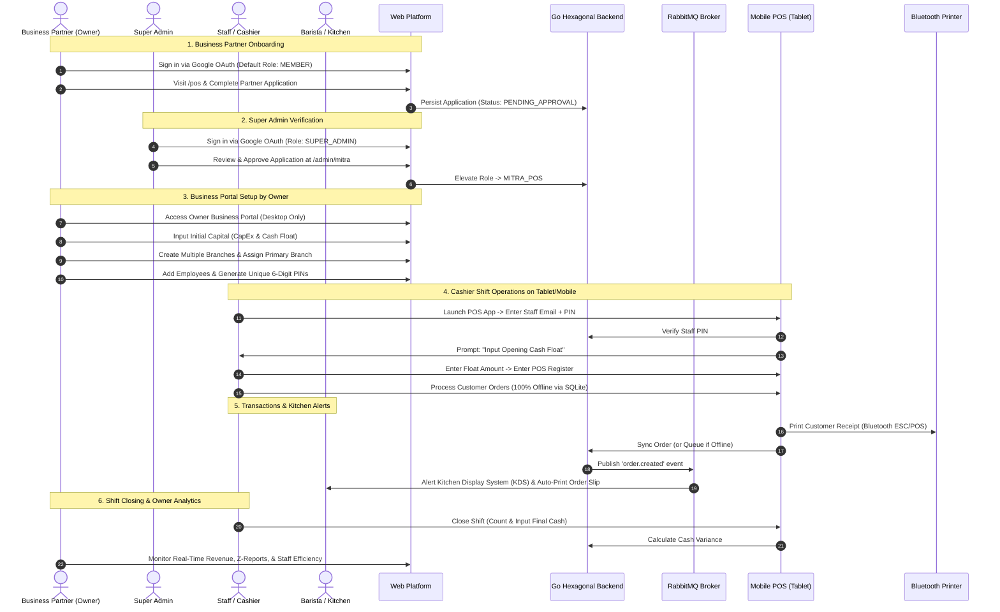
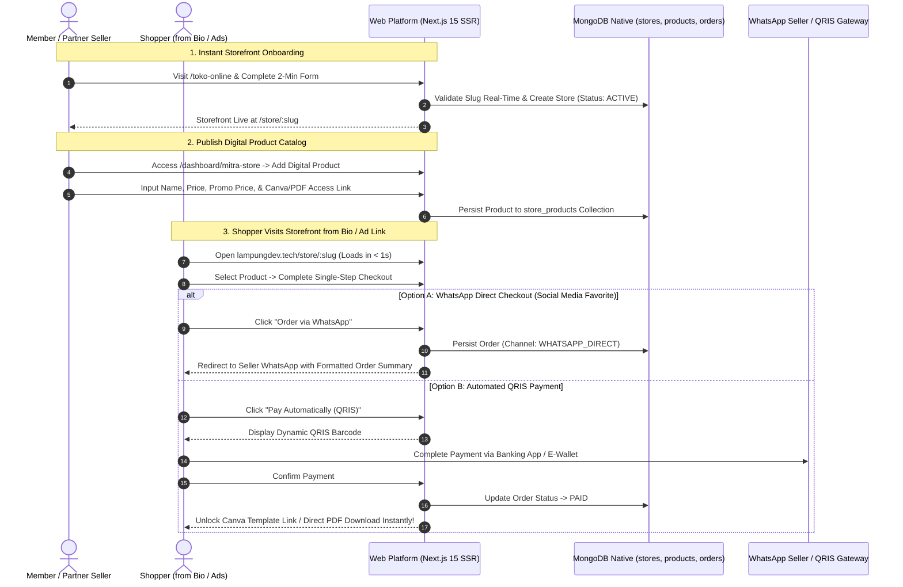

# LampungDevTech Platform

<div align="center">
  
  <h3>Developer Community Platform & Digital Business Ecosystem of Lampung</h3>
  <p>A collaborative hub for tech talent and local business empowerment through enterprise-grade digital solutions.</p>

  <p>
    <a href="https://github.com/lampungdevtech/lampungdevtech-platform/actions"></a>
    <a href="https://nodejs.org/"></a>
    <a href="https://pnpm.io/"></a>
    <a href="https://nx.dev/"></a>
    <a href="LICENSE"></a>
  </p>
</div>

---

## 🎯 Project Motivation & Problem Statement

LampungDevTech was conceived not merely as a community directory, but as an integrated ecosystem built to solve three tangible challenges in Lampung Province:

### 1. Fragmentation in the Tech Talent & Community Ecosystem
- **Problem**: Tech community activities (meetups, workshops, certifications) are often scattered and poorly archived, hindering developers and students in Lampung from networking and advancing their digital skills.
- **Solution**: An integrated **MongoDB-powered Event Management system** featuring automated capacity controls, atomic waiting-list queues, and QR code-based check-in attendance.

### 2. Operational Sustainability for Early-Stage Cafe & F&B Entrepreneurs
- **Problem**:
  - **Mismanagement of Initial Capital (CapEx vs. OpEx)**: Most novice cafe owners fail to track upfront capital investments (rent, espresso machines, bar fit-outs), blinding them to their true Break-Even Point (BEP) and net profit margins.
  - **Raw Material Leakage & BOM Inaccuracy**: The absence of precise Bill of Materials (BOM) tracking leads to unchecked waste and theft of milk, syrups, and coffee beans, eroding margins.
  - **Offline Vulnerability**: Pure-cloud POS systems fail when internet connections drop during peak hours, causing long queues and lost revenue.
  - **Multi-Branch Blind Spots**: Expanding to a second or third branch makes centralized staff oversight, cash shift reconciliation, and real-time menu management difficult.
- **Solution**: LampungDevTech delivers an **Offline-First Multi-Branch Cafe POS Ecosystem**:
  - A desktop-optimized Business Owner Portal for tracking CapEx, calculating BEP, managing multiple branches, configuring recipes (BOM), and auditing staff performance.
  - A **React Native Expo Offline-First** tablet/mobile POS app running local SQLite and ULID generators that operates seamlessly without internet, complete with Bluetooth thermal printer (ESC/POS) integration and automated Kitchen Display System (KDS) alerts.

### 3. Financial Independence for Creators & Social Media Sellers (Partner Online Storefronts)
- **Problem**:
  - **Predatory Marketplace Commissions (10% - 20%)**: Online sellers and local creators who generate their own traffic via social media (Instagram bio, TikTok, WhatsApp) see their margins decimated by conventional e-commerce platform fees.
  - **Price Wars & Customer Disconnection**: Marketplaces place products alongside cutthroat competitors and conceal buyer WhatsApp contacts, crippling repeat orders and relationship building.
  - **Digital Product Delivery Barriers**: Traditional marketplaces require physical shipment waybills (resi), making it cumbersome to sell Canva templates, e-books, fonts, source code, or design presets.
- **Solution**: LampungDevTech introduces the **Partner Online Storefront Ecosystem (Social Commerce)**:
  - **0% Marketplace Take Rate**: 100% of sales revenue goes directly to the partner seller.
  - **Sub-Second Instant Storefronts**: Mobile-first link-in-bio storefronts (`lampungdev.tech/store/:slug`) built with Next.js 15 Server Components, primed for Meta Ads and TikTok Ads conversion.
  - **Automated Digital Product Fulfillment**: Instant delivery of Canva template duplication links, Google Drive/Notion access, or downloadable PDF files immediately upon payment confirmation without requiring shipping waybills.
  - **Dual Checkout Modes**: Rapid checkout via formatted WhatsApp direct messaging or automated QRIS dynamic payments.
  - **Instant Partner Onboarding**: A 2-minute registration form embedded directly on the `/toko-online` landing page with real-time slug availability checks.

---

## 🔄 End-to-End Business & User Workflows

### 1. Cafe POS & Business Operations Workflow



### 2. Online Storefront & Digital Product Workflow



---

## 🌟 Key Features

### 1. Community Platform & Event Management
- **Bilingual Support (i18n)**: Localized routes `/id` (Default) and `/en`, cookie-persisted language preferences, and an interactive Language Switcher component.
- **MongoDB-Powered Event Engine**: Event listings, full-text search, status and category filtering, atomic ticket capacity with `$inc`, automated waiting lists, and QR code check-in attendance.

### 2. Cafe POS Business Solutions (POS Partners)
- **Interactive BEP & ROI Calculator**: Break-even time simulations based on rental overhead, espresso machinery, BOM costs, and daily sales targets.
- **Multi-Branch Operations**: Multi-store management, table layout configuration, and branch-specific menu pricing.
- **Bill of Materials (BOM) & Automated Cost of Goods Sold (COGS)**: Recipe-to-inventory mapping to prevent ingredient leakage and calculate gross margins per menu item.
- **Staff Access & PIN Authentication**: Employee onboarding with unique 6-digit PIN generators for fast shared-device login without Google OAuth.
- **Staff Performance Analytics**: Tracking transaction volumes, cashier revenue contribution, fulfillment speed, and shift cash discrepancy history.

### 3. Mobile POS (React Native Expo)
- **Offline-First Resilience**: Uninterrupted operations without internet connectivity using **SQLite (`expo-sqlite`)** and **ULID** generators.
- **Background Sync Queue**: Automated transaction ingestion upon reconnecting with idempotent API protection.
- **Bluetooth ESC/POS Thermal Printing**: Instant printing of customer receipts and kitchen tickets.

### 4. Partner Online Storefronts & Social Commerce
- **0% Platform Take Rate**: Partner sellers retain 100% of their sales revenue with zero platform commission deductions.
- **Sub-Second Mobile Storefronts (Link in Bio)**: Responsive storefronts (`/store/[storeSlug]`) rendered via Next.js 15 Server Components, optimized for high conversion from Meta Ads, TikTok Ads, and Instagram bios.
- **Automated Digital Product Fulfillment**: Instant access delivery for Canva template links, Google Drive/Notion folders, or PDF downloads immediately upon payment confirmation without physical waybills.
- **Dual Checkout Options**:
  - *WhatsApp Direct Mode*: Pre-fills seller WhatsApp chats with structured order summaries (buyer details, product, total).
  - *Automated QRIS Mode*: Seamless QR payment with real-time verification and instant digital asset unlocking.
- **Instant Embedded Onboarding**: A 2-minute registration form embedded on the `/toko-online` landing page with real-time slug availability checks.
- **Unified Seller Dashboard**: A dedicated portal at `/dashboard/mitra-store` for tracking revenue, managing digital catalogs, and processing incoming orders.

---

## 🏗️ System Architecture & Technology Stack

```
                               ┌─────────────────────────────────────────┐
                               │       Client & Application Layer        │
                               └─────────────────────────────────────────┘
                                  │                     │               │
                     ┌────────────┴──────────┐   ┌──────┴──────┐ ┌──────┴──────────┐
                     │ Next.js 15 Web & POS  │   │ Mobile POS  │ │ Kitchen Display │
                     │   Owner Dashboard     │   │ (Expo/SQLite│ │ (KDS Tablet/Web)│
                     └───────────────────────┘   └─────────────┘ └─────────────────┘
                                  │                     │               │
                               ┌─────────────────────────────────────────┐
                               │  API Gateway (Traefik / Nginx Reverse)  │
                               └─────────────────────────────────────────┘
                                  │
                               ┌─────────────────────────────────────────┐
                               │   GoFiber Hexagonal Microservices       │
                               │   (REST fasthttp & gRPC Protobuf)       │
                               ├─────────────┬─────────────┬─────────────┤
                               │ auth-svc    │ order-svc   │ catalog-svc │
                               ├─────────────┼─────────────┼─────────────┤
                               │ inv-svc     │ finance-svc │ notif-svc   │
                               └─────────────┴─────────────┴─────────────┘
                                  │           │             │           │
            ┌─────────────────────┴───┐ ┌─────┴──────────┐ ┌┴───────────┴─────────┐
            │ PostgreSQL (Transactional│ │ MongoDB (Event │ │ Redis (Locks & Cache)│
            │  Ledger, Branches, Shift)│ │  & Menu Catalog│ │ RabbitMQ (Outbox Bus) │
            └─────────────────────────┘ └────────────────┘ └───────────────────────┘
```

| Layer | Technology | Role / Description |
| :--- | :--- | :--- |
| **Frontend Web** | Next.js 15 (App Router), React 19, TypeScript | Public platform, partner onboarding portal, storefronts, and owner dashboard. |
| **Design & UI** | Tailwind CSS, Radix UI Primitives, Lucide Icons | Responsive layouts, dark/light modes, and internal package `@lampung-devtech/shared-ui`. |
| **Mobile POS** | React Native Expo, SQLite (`expo-sqlite`), ULID | Offline-first tablet/mobile POS cashier application with Bluetooth ESC/POS printing. |
| **Backend Services** | Go 1.23+, GoFiber (`fasthttp`), gRPC Protobuf | High-throughput microservices using Hexagonal Architecture. |
| **Database** | PostgreSQL 16 & MongoDB 7.0 | PostgreSQL for ACID financial ledger; MongoDB for menu catalogs, storefronts, & events. |
| **Cache & Locks** | Redis 7 | Distributed locking for tables/orders and high-performance caching. |
| **Messaging** | RabbitMQ 3.13 (Topic Exchange) | Asynchronous event bus (*order.created*, *stock.low_alert*, *shift.closed*). |
| **Infrastructure** | Docker Compose & Kubernetes (K3s / Managed K8s) | Docker Compose for local dev; K8s with HPA autoscalers for peak cafe traffic. |

---

## 📁 Repository Structure (Nx Monorepo)

```
lampungdevtech-platform/
├── apps/
│   ├── web/                                # Next.js 15 Web Platform & Partner Portals
│   │   ├── app/
│   │   │   ├── [locale]/                   # Bilingual routes (/id, /en)
│   │   │   │   ├── events/                 # Event listings & detail pages
│   │   │   │   ├── pos/                    # POS landing page & partner registration
│   │   │   │   │   ├── register/           # POS partner registration form
│   │   │   │   │   └── dashboard/          # Cafe Owner Business Portal (BEP, CapEx, Staff)
│   │   │   │   ├── toko-online/            # Landing page & embedded partner registration
│   │   │   │   ├── store/[storeSlug]/       # Partner storefront & digital checkout
│   │   │   │   │   ├── [productSlug]/      # Product detail & single-step checkout
│   │   │   │   │   └── order/[orderId]/    # Order status & digital fulfillment
│   │   │   │   ├── dashboard/mitra-store/  # Partner seller dashboard (products & orders)
│   │   │   │   └── admin/mitra/            # Super Admin partner approval portal
│   │   │   └── api/                        # API route handlers
│   │   │       ├── events/                 # Event registration & check-in APIs
│   │   │       ├── pos/                    # POS partner application APIs
│   │   │       └── store/                  # Online store, slug validator, & checkout APIs
│   │   ├── components/                     # UI components & Language Switcher
│   │   │   ├── store/                      # Onboarding forms & storefront components
│   │   │   └── ...
│   │   ├── services/                       # Database service layer (MongoDB native)
│   │   │   ├── event.service.ts
│   │   │   └── store.service.ts            # Storefront, digital products, & orders service
│   │   ├── types/                          # TypeScript contracts (Store, StoreProduct, StoreOrder)
│   │   ├── i18n/                           # next-intl routing configuration
│   │   └── locales/                        # Translation dictionaries (id & en)
│   └── web-e2e/                            # End-to-End testing (Cypress)
├── packages/
│   └── shared-ui/                          # Shared UI component library (@lampung-devtech/shared-ui)
├── docs/                                   # Modular technical architecture specifications
│   ├── 01-event-management-mongodb.md      # Event Management (MongoDB) Specifications
│   ├── 02-pos-business-web-platform.md     # Owner Portal & POS Landing Specifications
│   ├── 03-pos-backend-hexagonal-microservices.md # GoFiber Hexagonal Backend Architecture
│   ├── 04-pos-mobile-offline-first.md      # SQLite, ULID, & ESC/POS Mobile POS Specifications
│   ├── 05-pos-devops-infrastructure-cicd.md# Kubernetes (K8s) & Docker Deployment Guide
│   └── 06-mitra-store-digital-products.md  # Partner Storefronts & Digital Products Guide
├── pnpm-workspace.yaml                     # pnpm workspace configuration
├── nx.json                                 # Nx task runner configuration
└── package.json                            # Monorepo root dependencies
```

---

## 🚀 Getting Started with Local Development

### Prerequisites
Ensure your development workstation has the following installed:
- **Node.js**: Version **>= 24.x LTS** (strictly matching the CI runner).
- **pnpm**: Version **>= 11.x** (monorepo package manager).
- **Docker & Docker Compose**: (Optional, for running PostgreSQL, MongoDB, Redis, and RabbitMQ locally).
- **Git**: Latest version.

### 1. Clone the Repository
```bash
git clone https://github.com/lampungdevtech/lampungdevtech-platform.git
cd lampungdevtech-platform
```

### 2. Install Workspace Dependencies
Use `pnpm` to install all workspace dependencies:
```bash
pnpm install
```

### 3. Configure Environment Variables
Copy the template configuration files from `.env.example` to `.env` and `apps/web/.env.local`:
```bash
cp .env.example .env
cp .env.example apps/web/.env.local
```
> [!NOTE]
> The [`.env.example`](.env.example) file is fully documented in English and covers configurations for Web Platform, MongoDB, PostgreSQL, Redis, RabbitMQ, JWT Secrets, and Google OAuth credentials.

### 4. Run the Web Development Server (Nx Dev)
Start the Next.js 15 web application using Nx:
```bash
# Start the web app
pnpm exec nx dev web

# Or using shortcut script
pnpm start:web
```
Open your browser and navigate to the following endpoints:
- **Home & Community**: `http://localhost:3000/` (Auto-redirects to `/id` or `/en`)
- **Event Management**: `http://localhost:3000/id/events`
- **Ticket Check-In Scanner**: `http://localhost:3000/id/events/check-in`
- **POS Business & Education**: `http://localhost:3000/id/pos`
- **Cafe POS Partner Registration**: `http://localhost:3000/id/pos/register`
- **Super Admin Partner Approval Portal**: `http://localhost:3000/id/admin/mitra`
- **Owner Business Portal (BEP & CapEx)**: `http://localhost:3000/id/pos/dashboard`
- **Cashier Terminal (Web Tablet Emulator)**: `http://localhost:3000/id/pos/terminal`
- **Kitchen Display System (KDS Kitchen & Bar)**: `http://localhost:3000/id/pos/kds`
- **Partner Storefront Landing Page & Registration**: `http://localhost:3000/id/toko-online`
- **Partner Seller Dashboard**: `http://localhost:3000/id/dashboard/mitra-store`
- **Partner Demo Storefront (Link-in-Bio)**: `http://localhost:3000/id/store/lampung-digital`
- **Digital Product & Fast Checkout Demo**: `http://localhost:3000/id/store/lampung-digital/bundle-canva-umkm-lampung`

### 5. Launch Local Infrastructure (Docker Compose)
To spin up PostgreSQL 16, MongoDB 7.0, Redis 7, and RabbitMQ 3.13 locally:
```bash
docker compose up -d
```
Service dashboards and connection ports:
- **RabbitMQ Management**: `http://localhost:15672` (User: `guest`, Pass: `guest`)
- **MongoDB Native**: `localhost:27017`
- **PostgreSQL**: `localhost:5432` (Database: `pos_db`)
- **Redis**: `localhost:6379`

### 6. Run the GoFiber Hexagonal Backend Service
Ensure Go 1.23+ or Docker is installed, then launch the service:
```bash
cd backend
go run cmd/server/main.go
# Or with Docker:
docker build -t pos-backend .
docker run -p 8080:8080 pos-backend
```
The service will be active on port `8080` (`http://localhost:8080/healthz`).

### 7. Run the Mobile POS (React Native Expo)
To test the tablet and mobile cashier application on an Android, iOS simulator, or browser:
```bash
cd apps/mobile-pos
pnpm start
# Press 'w' for web preview, or 'a' for Android emulator
```

### 8. Testing, Linting & Production Build
Use unified commands from Nx:
```bash
# Validate TypeScript types across workspace
npx tsc --project apps/web/tsconfig.json --noEmit

# Run linter
pnpm exec nx lint web

# Run unit tests
pnpm exec nx test web

# Build production bundle (generates 68 pages)
pnpm exec nx build web
```

---

## 📚 Technical Architecture Documentation (`/docs`)

Comprehensive architecture specifications and step-by-step implementation guides are maintained locally in the `/docs` directory (ignored by git to keep the core repository lightweight):
- `docs/01-event-management-mongodb.md` — Event Management, MongoDB Native, & Atomic Quota Specifications
- `docs/02-pos-business-web-platform.md` — Owner Portal, BEP Calculator, & Multi-Branch Specifications
- `docs/03-pos-backend-hexagonal-microservices.md` — GoFiber Hexagonal Microservices & RabbitMQ Event Bus
- `docs/04-pos-mobile-offline-first.md` — Offline SQLite Sync Engine, ULID, & Bluetooth ESC/POS
- `docs/05-pos-devops-infrastructure-cicd.md` — Kubernetes (K8s), Docker Compose, & Observability Specifications
- `docs/06-mitra-store-digital-products.md` — Partner Storefronts, Digital Products, & WhatsApp Checkout
- `docs/walkthrough-event.md` — Comprehensive implementation walkthrough

---

## 🤝 Contribution Guidelines & Git Conventions

We warmly welcome community contributions! Please follow our workflow to keep development clean and consistent:

### Branching Model
- `main`: Production-ready release branch.
- `staging`: Integration branch before merging to `main`.
- `feat/<feature-name>`: Feature branch (branched from `staging`).
- `fix/<bug-name>`: Bugfix branch.

### Commit Message Standards (Conventional Commits)
Use Commitizen / Conventional Commits format:
```bash
feat(store): implement partner storefront and digital product delivery
fix(events): resolve atomic capacity decrement issue
docs(readme): translate documentation to english and add store ecosystem
test(web): add unit tests for language switcher
```

---

## 💬 Community & Discussion
- **Telegram Group**: [t.me/lampungdevtech](https://t.me/lampungdevtech)
- **GitHub Discussions**: [github.com/lampungdevtech/lampungdevtech-platform/discussions](https://github.com/lampungdevtech/lampungdevtech-platform/discussions)
- **Official Website**: [lampungdev.tech](https://lampungdev.tech)

---

## 📄 License
This repository is licensed under the open-source [MIT License](LICENSE).
